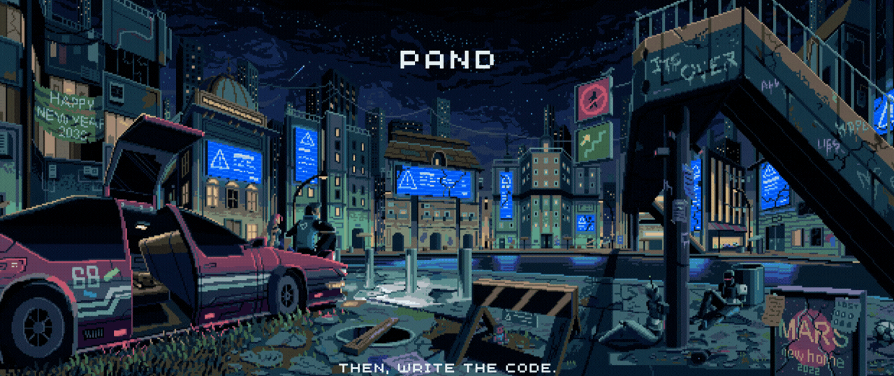

  

<h1 align="center">Hi, I'm Pand</h1>

## About Me

I'm a web developer and musician passionate about technology, pixel art, and video games. I love creating clean, dynamic, and practical web experiences, always focusing on minimalism and organization in every project.

I've been coding since 2018 and I'm currently finishing my degree in Systems Engineering. My goal is to build impactful projects for the web development community in Latin America.

I'm also continuously learning new skills while building tools to help others. 🍃 こんにちは!

---

## Tech Stack & Tools

  

---

  Banner art by <a href="https://x.com/kirokaze">Kirokaze</a>

